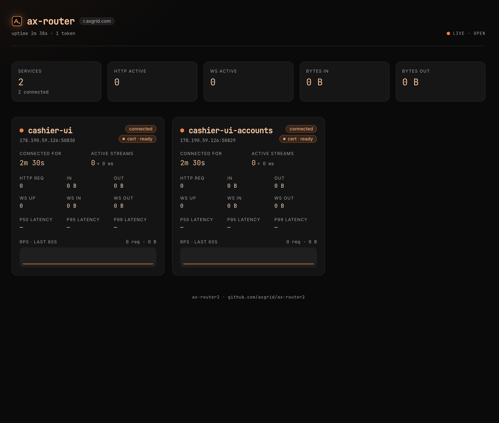

# ax-router2

<p align="center">
  
</p>

A reverse HTTP/WebSocket router. Local services, anywhere on the internet,
register **outbound** to a single public server and receive traffic for
their assigned subdomain. No port-forwarding, no VPN, no per-service public
IP — one TCP connection per service, multiplexed via yamux.

```
                                          ╔═══════════════════════════════╗
                                          ║  ax-router server (router.com)║
   browsers / curl ──HTTPS───►   *.foo.router.com   ──┐                    ║
   browsers / curl ──HTTPS───►   *.bar.router.com   ──┼──┐                 ║
                                          ║          │  │                  ║
                                          ║          ▼  ▼                  ║
                                          ║       yamux mux per client     ║
                                          ╚═════════║════║═════════════════╝
                                                    ║    ║
                                            ┌───────╨─┐  ╨─────────┐
                                            │ client  │  │ client  │
                                            │  foo    │  │  bar    │
                                            │ (your   │  │ (your   │
                                            │  app)   │  │  app)   │
                                            └─────────┘  └─────────┘
```

## Features

* **Subdomain-per-service routing.** Service `foo` lives at `*.foo.router.com`
  (any depth — `api.foo.router.com`, `v2.api.foo.router.com`, …).
* **Two client modes:**
  * `client.NewHandler(cfg, http.Handler)` — drop in any `http.Handler`
    (`*http.ServeMux`, chi, gin etc.). WebSocket via `http.Hijacker`.
  * `client.NewProxy(cfg, "http://localhost:8080")` — byte-perfect TCP
    forwarder to a real upstream. Works for HTTP and WebSocket transparently.
* **Reconnect grace.** A short window where requests for a freshly-dropped
  client are held instead of immediately 502'd, so `kill && restart` is
  invisible to callers.
* **Live dashboard.** Hit the apex (`router.com`) for an orange/black React
  status page with per-service counters, latency percentiles, and a 60-second
  RPS sparkline — pushed in real time over WebSocket.
* **Hot-reloadable tokens.** File-based token map auto-reloads on change
  (`fsnotify`) or on `SIGHUP`.
* **Wildcard TLS via Let's Encrypt DNS-01.** Optional, see section below.

## Layout

```
ax-router2/
├── cmd/ax-router/        # server binary main
├── server/               # server-side library (router, admin, TLS, stats)
├── client/               # client-side library (handler-mode + proxy-mode)
├── internal/protocol/    # control-channel handshake before yamux
├── web/                  # React + Vite + Tailwind dashboard (embedded)
├── examples/             # handler / proxy / websocket example clients
├── .claude/skills/       # Claude Code skill for generating clients
├── tests/e2e/            # end-to-end tests
└── Makefile
```

## Quick start

```bash
# 1. Build everything (Go binary + React dashboard).
make all

# 2. Configure the server.
cp .env.example .env
$EDITOR .env                                     # set AXR_BASE_DOMAIN, AXR_TOKENS

# 3. Run the server.
./bin/ax-router

# 4. Run a client (handler mode example).
AXR_SERVER=localhost:7000 AXR_TOKEN=globalsecret AXR_SERVICE=foo \
  go run ./examples/handler

# 5. Hit it through the router.
curl -H 'Host: api.foo.router.com' http://localhost/
```

## Server configuration

Every setting lives in `.env`. The full list is documented in
[`.env.example`](./.env.example); a high-level summary:

| Variable | Purpose |
|---|---|
| `AXR_BASE_DOMAIN` | Apex domain. Service names live as subdomains under it. |
| `AXR_PUBLIC_ADDR` | Plain HTTP listener (`:80`). |
| `AXR_PUBLIC_TLS_ADDR` | HTTPS listener (`:443`); leave empty for plaintext-only. |
| `AXR_CONTROL_ADDR` | Where router-clients connect (`:7000`). |
| `AXR_RECONNECT_GRACE` | How long to hold inbound requests during a brief disconnect. |
| `AXR_TOKENS` | Inline `token:service` pairs (`*` = any service). |
| `AXR_TOKENS_FILE` | JSON `{token:service}`. Hot-reloaded on change or `SIGHUP`. |
| `AXR_ADMIN_USER` / `AXR_ADMIN_PASS` | Optional basic auth on the dashboard. |
| `AXR_TLS_MODE` | `off` / `file` / `autocert` / `dns`. |
| `AXR_HTTPS_REDIRECT` | `true` to 301 plain HTTP → HTTPS (ACME challenges + cert-issuance page are auto-exempted). |

## Routing

Service name = the **last** subdomain label, after stripping
`.<AXR_BASE_DOMAIN>`:

| Host | Service |
|---|---|
| `foo.router.com` | `foo` |
| `api.foo.router.com` | `foo` |
| `v2.api.foo.router.com` | `foo` |
| `router.com` | (apex → dashboard) |

Service names must match `^[a-z0-9][a-z0-9-]{0,30}$`. The apex itself is
reserved and cannot be registered by any service.

## Authentication

A token is either:

* **Bound** to a specific service: the client may register only that one
  name, regardless of what its Hello says.
* **Wildcard (`"*"`)**: the client supplies its desired service name in
  the Hello frame. Last-writer-wins on collision (a reconnect just takes
  over its own slot).

```bash
# Single shared token, all clients pick their own service name.
AXR_TOKENS=globalsecret:*

# Mixed: admin can claim anything; web is locked to its name.
AXR_TOKENS=admin:*,web-token:web
```

Tokens loaded from `AXR_TOKENS_FILE` are hot-reloadable: edit the file or
send `SIGHUP` to the process. Inline `AXR_TOKENS` entries are not reloaded.

## Client modes

### Handler mode

You write a regular `http.Handler` (or `*http.ServeMux`) and the client
runs it against requests forwarded by the router:

```go
mux := http.NewServeMux()
mux.HandleFunc("/", func(w http.ResponseWriter, r *http.Request) {
    fmt.Fprintf(w, "hi from %s\n", r.Host)
})

c, _ := client.NewHandler(client.Config{
    ServerAddr: "router.com:7000",
    Token:      "globalsecret",
    Service:    "foo",                     // required for wildcard tokens
}, mux)

ctx, cancel := signal.NotifyContext(context.Background(), os.Interrupt)
defer cancel()
_ = c.Run(ctx)
```

WebSockets work through `http.Hijacker` exactly like a normal HTTP server,
so libraries like `gorilla/websocket` are drop-in.

### Proxy mode

The client opens a fresh TCP connection per request to a real upstream
service and shovels bytes both ways. HTTP and WebSocket flow through the
same code path:

```go
c, _ := client.NewProxy(client.Config{
    ServerAddr: "router.com:7000",
    Token:      "globalsecret",
    Service:    "foo",
}, "http://localhost:8080")

_ = c.Run(ctx)
```

This is the right choice when your local service is already listening on a
real socket and you want zero application changes.

## Dashboard

`https://<AXR_BASE_DOMAIN>` serves an embedded React SPA. It connects
back via WebSocket to `/__router/ws` and refreshes every second. Per
service you'll see:

* connection state, remote IP, time-since
* HTTP requests, active streams, bytes in/out
* WebSocket upgrades, active sockets, bytes in/out
* p50/p95/p99 request latency
* RPS over the last 60 seconds (sparkline)

If `AXR_ADMIN_USER` and `AXR_ADMIN_PASS` are both set, all admin endpoints
(including the dashboard and `/__router/api/state` JSON) are gated by
basic auth.

## Health check

`GET /health` is auth-free, host-agnostic, and answers on plain HTTP even
when `AXR_HTTPS_REDIRECT=true` — so k8s liveness probes, load balancers,
and `curl http://<ip>/health` all work without a Host header rewrite.

* `200 OK` body `ok` — server is responsive.
* `500 Internal Server Error` body `fail: tokens: <error>` — the most
  recent reload of `AXR_TOKENS_FILE` failed, so new clients can't
  authenticate. Existing connections continue to serve.

This shadows any service-level `/health` on a sub-host. Downstream
services should expose their own health on a different path (e.g.
`/healthz`, `/_status`) if you want both reachable through the router.

## Per-service certificate pre-warm

When `AXR_TLS_MODE=autocert` (or `dns`), each time a router-client registers,
the server immediately kicks off ACME issuance for `<service>.<base>` in the
background. Any incoming request to the service while issuance is still in
flight gets a small **"Issuing certificate"** loading page (orange/black,
auto-refreshing every 2s, with elapsed timer). When issuance finishes the
next request flows through normally.

Failure mode: if ACME returns an error (e.g. rate limit, DNS misconfig),
the page switches to an error variant showing the underlying message until
the operator intervenes. Cert status (`pending` / `ready` / `error`) is
also shown on the dashboard as a small pill on each service card.

The autocert host policy is dynamic: `<service>.<base>` is allowed as soon
as the service has been registered at least once (gated to keep the
Let's Encrypt rate-limit budget safe). Listed `AXR_TLS_AUTOCERT_DOMAINS`
remain whitelisted independently.

> Note: `autocert` mode uses HTTP-01 / TLS-ALPN-01 — only the bare
> `<service>.<base>` host gets a cert, not deeper subdomains
> (`api.<service>.<base>`). For the full multi-level wildcard story see the
> next section.

## Wildcard certificate

A wildcard cert via Let's Encrypt requires the **DNS-01** challenge — the
HTTP-01 / TLS-ALPN-01 challenges used by `golang.org/x/crypto/acme/autocert`
do **not** support `*.<base>` names. ax-router2 ships an opt-in DNS-01
mode built on [`certmagic`](https://github.com/caddyserver/certmagic) +
[`libdns`](https://github.com/libdns/libdns).

> Most deployments don't need this — terminating TLS at a wildcard-friendly
> proxy (Cloudflare, Caddy with DNS-01, AWS ACM) and pointing it at
> `AXR_PUBLIC_ADDR` is simpler. Use this mode only when you want the Go
> binary itself to manage certificates.

### Provider

Currently supported: **DigitalOcean** (`AXR_DNS_PROVIDER=digitalocean`).
Adding more providers is a one-import change in `server/acme_dns.go` —
pick any [libdns provider](https://github.com/libdns) and add a `case`
in `buildLibdnsProvider`.

### Setup

1. Make sure your authoritative DNS is hosted on DigitalOcean and your
   apex (`router.com`) plus its subdomains resolve through it.
2. Create a DigitalOcean API token with **write access to DNS records**
   (Spaces / Compute scopes are not needed).
3. Configure `.env`:

   ```bash
   AXR_TLS_MODE=dns
   AXR_PUBLIC_TLS_ADDR=:443
   AXR_DNS_PROVIDER=digitalocean
   DIGITALOCEAN_TOKEN=dop_v1_…

   AXR_ACME_EMAIL=ops@yourcompany.com
   AXR_ACME_CACHE=/var/lib/ax-router/acme-cache

   # Optional — pre-issue a wildcard at startup.
   AXR_ACME_DOMAINS=*.router.com,router.com

   # Optional — exercise the staging endpoint first to avoid LE rate limits.
   AXR_ACME_STAGING=true
   ```

4. Start the server. On the first TLS handshake for a hostname under
   `<AXR_BASE_DOMAIN>`, certmagic will provision a cert if one isn't
   cached. Renewals run automatically.

### One-level vs multi-level subdomains

A wildcard `*.router.com` cert covers **one** label, so it serves
`foo.router.com` but not `api.foo.router.com`. ax-router2 handles this
transparently:

* If you list `*.router.com` in `AXR_ACME_DOMAINS`, that cert is
  pre-issued and used for any single-label subdomain.
* For deeper subdomains (`api.foo.router.com`), certmagic's **on-demand**
  mode kicks in: a cert is issued lazily on the first TLS handshake for
  that exact name. The on-demand whitelist is hard-coded to names ending
  in `.<AXR_BASE_DOMAIN>` (or the apex itself), so the server cannot be
  abused as an open ACME proxy.

### Quotas

Let's Encrypt has rate limits (currently 50 certs / week / registered
domain, with a higher quota for the wildcard). On-demand issuance can hit
this if you have many deep subdomains. For high-cardinality deployments
prefer pre-issuing the wildcard and keeping subdomains one-level deep.

## Building for Linux

The Makefile cross-compiles to Linux from any host (no Docker / no
toolchain swap — pure `GOOS`/`GOARCH`):

```bash
make build-linux              # both amd64 and arm64
make build-linux-amd64        # x86_64 only
make build-linux-arm64        # aarch64 only
make build-all                # linux + darwin, four binaries
make release VERSION=v0.1.0   # tarballs in dist/
```

Output:

```
bin/ax-router-linux-amd64        13 MB, statically linked, stripped
bin/ax-router-linux-arm64        12 MB, statically linked, stripped
dist/ax-router-linux-amd64-<ver>.tar.gz   binary + README + .env.example
```

`CGO_ENABLED=0` is set by default, so the binary runs on any glibc/musl
Linux (Alpine, Debian, RHEL, scratch container, etc.) without runtime
dependencies.

### Version + build number

* The semantic version comes from a tracked `VERSION` file (one line, e.g.
  `0.1.1`). Override on the CLI with `make build VERSION=2.0.0-rc1`.
* A monotonic build counter lives in `.build-number` (gitignored, local
  to each machine). Every `make build-*` increments it once per `make`
  invocation — `make build-all` shares one number across all four targets.
* The current Git short-SHA is also baked in.

All three are linked into the binary via `-ldflags -X main.…` and printed:

```bash
$ make version
ax-router 0.1.1 build #4 (a286211)

$ ./bin/ax-router -version
ax-router 0.1.1 build 4 (a286211) darwin/arm64
```

The same line is emitted to stderr at server startup. Release tarballs are
named `ax-router-<os>-<arch>-<version>-b<build>.tar.gz`.

## Examples

Three runnable examples live under `examples/`:

| Path | Demonstrates |
|---|---|
| `examples/handler/` | Minimal handler-mode client wrapping an `http.ServeMux`. |
| `examples/proxy/` | Proxy-mode client forwarding to a local HTTP server. |
| `examples/websocket/` | Real WebSocket broadcaster (gorilla/websocket) served simultaneously on a local port and through ax-router2 — the realistic "drop into existing project" pattern. |

Run any of them with:

```bash
AXR_SERVER=router.example.com:7000 AXR_TOKEN=<token> AXR_SERVICE=<name> \
  go run ./examples/<dir>
```

## Claude Code skill

A skill for [Claude Code](https://claude.com/claude-code) ships in
`.claude/skills/ax-router-client/`. When invoked it asks the user for
the router address, token, service name, and mode (handler / proxy),
then writes a fresh client or grafts the wiring into an existing Go
project (preserving any local listener that's already running).

Ways to invoke:

```text
> /skill ax-router-client
> "wire up an ax-router2 client for this service"
> "expose this through router.mycompany.com"
```

The skill is project-local: clone the repo and Claude Code picks it up
automatically. To install it globally, copy the directory to
`~/.claude/skills/ax-router-client/`.

## Tests

```bash
make test         # uses CGO_ENABLED=0 to dodge a known macOS dyld bug
```

The end-to-end suite covers HTTP forwarding, POST bodies, 502 on missing
client, Upgrade pumping, wildcard-token registration + apex dashboard,
and bad-name rejection.

## Wire format

* **Control TCP** (before yamux):
  `MAGIC(4) | VER(1) | LEN(2) | HelloJSON` →
  `MAGIC(4) | VER(1) | STATUS(1) | LEN(2) | AckJSON`. Then both sides switch
  to yamux on the same conn.
* **Per request**: a fresh yamux stream. The full HTTP/1.1 request is
  written by the public side and read by the client. The response comes
  back on the same stream. For `Upgrade:` requests the stream switches to
  raw byte-shovelling after the upgrade.

## License

MIT (or whatever you set in your fork — no license file ships by default).
